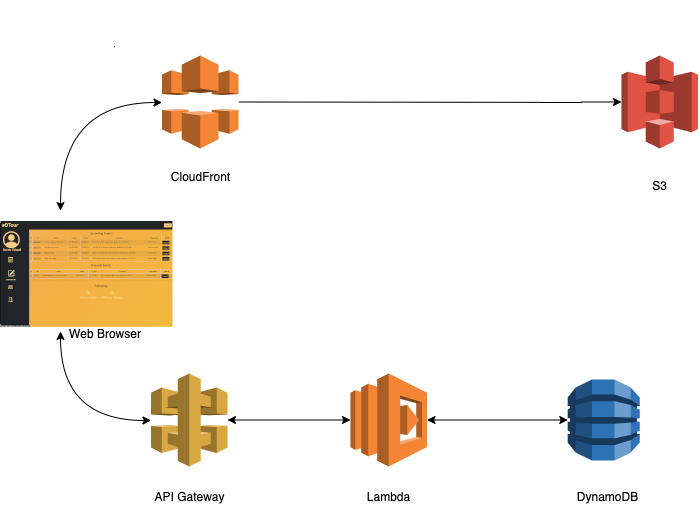

# NSS Midstone Group Project

## Project Starter Infrastructure

*Image 1: Architecture diagram for the @DTour project*

This project was a culmination of a two week intensive group back & front end build with no prior instruction in Webpack, JavaScript, HTML or CSS. Our team was given three days of concept and endpoint design time followed by 10 days of build time, and one day of presentation preparation to accomplish the deliverables and have a functional cloud API deployed to a front end web application.

A powerpoint outlining the project mission can be found here [@DTour PowerPoint](https://docs.google.com/presentation/d/1UVmT7e1QBgVxmuxp4RD5vVlZVpYPvCqlumgTPxhtTDg/edit?usp=sharing)

