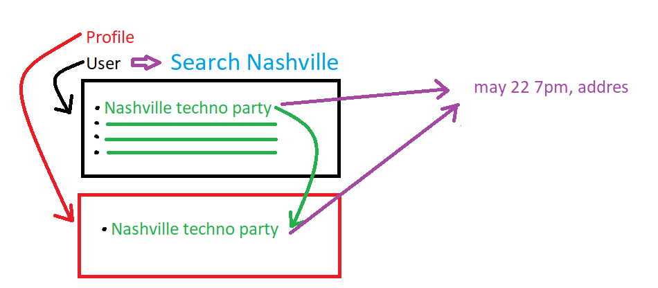
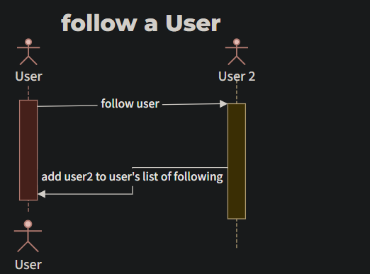
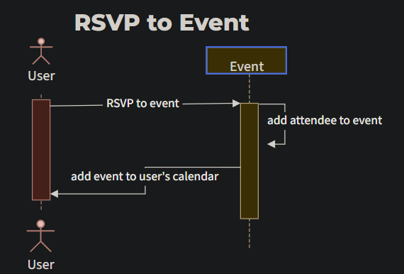

# Project Design Document - Event Social Media Web - Application

## 1. Problem Statement

Event driven social media app. Drive in person connections through local event discovery.

## 2. Top Questions to Resolve in Review

Things that we are still debating:

1. Are we allowing users to post an event; or we steal an info on the events happening;
2.
3.

## 3. Use Cases

_This is where we work backwards from the customer and define what our customers would like to do (and why).
You may also include use cases for yourselves (as developers), or for the organization providing the product
to customers._

U1. _As a user, I want to create a profile;
U1.1. _As a user, I want to delete a profile;
U1.2. _As a user, I want to update a profile;
U1.2. As a user, I want to view a profile; (with update & delete buttons);

U2. _As a user, I want to retrieve all the events;

U3. _As a user, I want to retrieve the events, that I chose (personal events); (RSVP - can attend/ unable);
U3.1. _As a user, I want to remove an event, that I chose/shortlisted (personal events);
U3.1. _As a user, I want to create a personal event;
U3.1. _As a user, I want to delete the event that user(that the same user) posted;

U4. _As a user, I want to filter events by location/ indoor and outdoor / by date / by event type; (global/personal use cases)

U5. _As a user, I want to see the peoples' profiles who are attending the event; (event details call)

(extension) U 5.1. As a user, I do not want to see the events that people from my blocked list attending;

U6. (extension) _As a user, I want to block the users (block people lists);

U**. (extension) _As a user, I want to create friends list;

U**. (extension) _As a user, I want to add a picture to my profile;

## 4. Project Scope

### 4.1. In Scope

Creating, deleting, updating and viewing a user's profile;
Creating, deleting, updating, viewing, and filtering and the ability to add events to user's list;
Ability to view peoples' profiles who are attending the event, RSVP and not RSVP;
Ability to filter events by location/ indoor and outdoor / by date / by event type;


### 4.2. Out of Scope

Ability to not see the list of events which is attended by people from my blocked list;
Ability to block the users I had bad experience with (do not like);
Ability to create a friends list;
Ability to research events by friends who are in my friends list;
GoogleMaps from profile's user call GoogleMap of the event to give an estimated time you need to commute;
Recommendations of another profiles who viewed the event, events that you might be interested, and events based on my friend's list;


# 5. Proposed Architecture Overview



# 6. API

## 6.1. Public Models

// ProfileModel

String userId;
Set <String> friends;
Set <String> events;


//EventsModel

String eventName;
String eventAddress;
String eventType;
ZonedDateTime date;
ZonedDateTime time;
Set <String> attendees;


//UserModel

String fullName;
String emailAddress;
String gender;
String dateOfBirth;


## 6.2. _Get / View Profile_
* Accepts 'GET' RQs to /profile/:userId
* Accepts an userId and returns a list of friends created by that user.
    * if the given user has not created any list -> empty list will be returned;
* Accepts an userId and returns a list of events created by that user.
    * if the given user has not created any list of events -> empty list will be returned;

## 6.3 _Create Profile_
* Accepts 'POST' RQs to /profile/
* Accepts data to create a new profile with user details such as fullName,
  emailAddress, gender, dateOfBirth. Returns a new profile with a unique userId;

## 6.3 _Update Profile
* Accepts 'PUT' RQs to /profile/:?userId=userId&isNew=false
* Accepts data to update a profile. Returns the updated
  profile.

## 6.4 _Update Profile_Friends List
* Accepts 'PUT' RQs to /profile/addFriend/:?userId=userId&friendId=fiendsId=friendsId
* Accepts data to update a list of friends. Returns the updated
  list of friends.
    * if userId or friendsId do not exist - UserNotFoundException will be thrown;

## 6.5 _Update Profile_Events List
* Accepts 'PUT' RQs to /profile/addEvent/:?userId=userId&eventId=eventId
* Accepts data to update an event list. Returns the updated
  list of Events.
    * if userId or eventId do not exist - EventNotFoundException will be thrown;

## 6.7 Get EventInfo
* Accepts 'GET' requests to /events/:eventId
* Accepts an eventId and Returns the corresponding Event details : eventName, address, type,
  date, time and list of attendees.
    * If the event is not found, will throw an 'EventNotFoundException'

## 6.8 Create Event
* Accepts a 'POST' request to /events/createEvent/
* Accepts data to create a new Event, with a provided name, address, type, date and time.
  Returns the new Event, with a unique eventID

## 6.9 Add to 'Following/ List
* Accepts PUT requests to /profile/addFollowing/:userId
* Accepts a userId to add a user to the current user profile's list of users they follow.
  Returns the updated following list.
* 

## 6.10 RSVP to Event Endpoint

* Accepts PUT requests to /Profile/events/:eventId
* Accepts an eventId to add an event to the current user profile's list of events they plan to attend.
  Returns the updated user profile's event list.
*  

## 6.11 Get User Endpoint

* Accepts GET requests to /User/:?userId=userId&email=email&dob=dob
* Accept userId,email, and Date of Birth then return the User information.

## 6. Create User Endpoint
* Accepts 'POST' requests to '/User/createUser/:?userId=userId&email=email&dob=dob
* Accept userId,email, and Date of Birth then create the User with given info.


## SQ diagram

 

# 7. Tables

_Define the DynamoDB tables you will need for the data your service will use. It may be helpful to
first think of what objects your service will need, then translate that to a table structure,
like with the *`Playlist` POJO* versus the `playlists` table in the Unit 3 project._

`Event`
``` 
eventId // partition key, string;
eventName // string;
eventDescription // string
eventAddress // string;
eventType // string;
date // ZonedDateTime;
time // ZonedDateTime;
attendees // Set<String>;
```
`User`
```
userId // partition key, string
fullName// string;
emailAddress // string;
gender // string;
dateOfBirth // LocalDate;
```
`Profile`
```
userId // partition key, string;
followers // Set <String>;
events // Set <String>;
```

# 8. Pages

_Include mock-ups of the web pages you expect to build. These can be as sophisticated as
mockups/wireframes using drawing software, or as simple as hand-drawn pictures that represent
the key customer-facing components of the pages. It should be clear what the interactions will
be on the page, especially where customers enter and submit data. You may want to accompany the
mockups with some description of behaviors of the page (e.g. "When customer submits the submit-dog-photo
button, the customer is sent to the doggie detail page")_


GetEventLambda
GetEventActivity

GetEventResult


MAKE SURE YOU ARE SHOWING FUTURE EVENTS AND NOT HISTORICAL EVENTS!!
